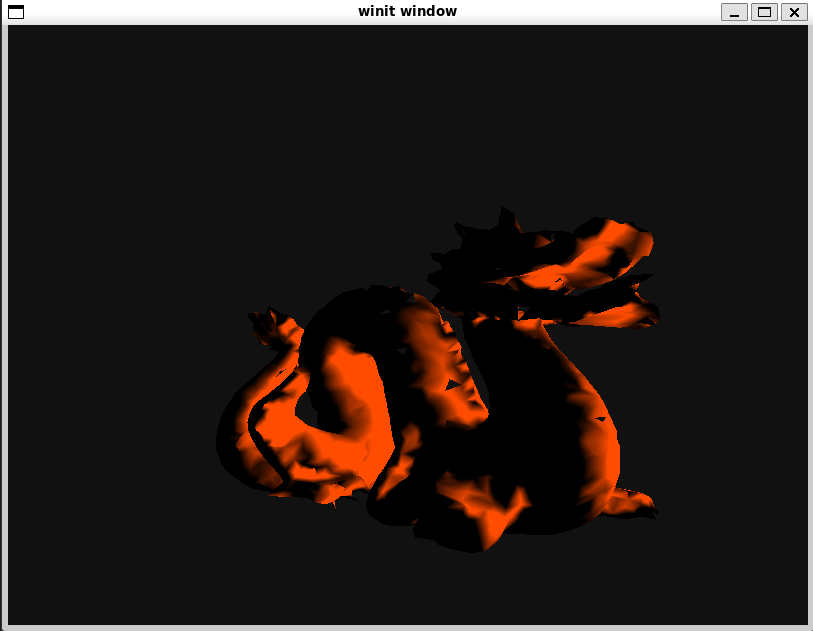

# Rust 3D Graphics
This project is a proof of concept of software rendering individual triangles to make up a 3D mesh.
**The code in this repository is a mess and probably unreadable due to a lack of comments**, again this is just a proof of concept. I wanted to learn how triangles were rasterized, as well as how clipping and other things work. 
**I also used what I learned in another repository, [fpga_graphics](https://github.com/ryanhaus/fpga_graphics), which was written in SystemVerilog.**

## Demo
Clone the repository and run `cargo run` (note: Rust is required first), assuming you have a valid display you should see a spinning 3D model of a dragon. The lighting kind of sucks but I'm pretty happy with what I was able to make.

